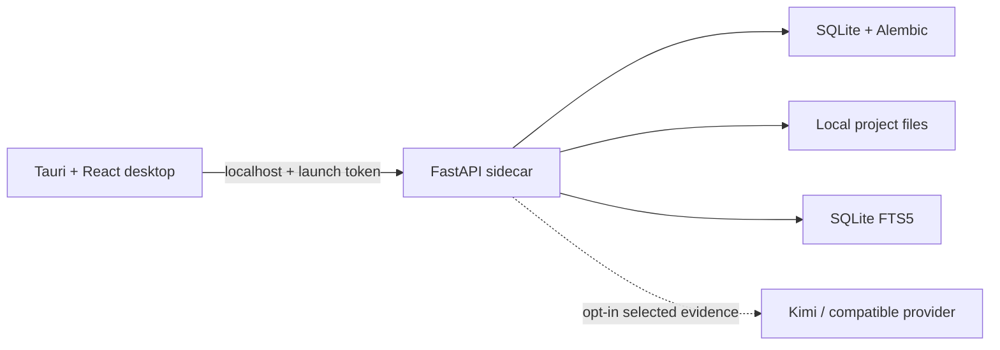

# ProjectMind Engineering AI

ProjectMind is a Windows-first engineering knowledge and document-intelligence application. It is designed to become a traceable, revision-aware project memory for construction teams rather than a general chatbot.

Version 0.2.0 contains a usable local-first product workspace:

- Persistent Tauri 2/React 19/Fluent UI navigation with Home, Projects, Settings, and project workspaces.
- Bundled FastAPI sidecar architecture; end users will not need Python.
- Authenticated localhost communication with a random per-launch session token.
- Project creation, editing, archiving, local folder selection, and per-project scan controls.
- Local PDF, DOCX, XLSX/XLSM, CSV, Markdown, and text extraction with SHA-256 duplicate and revision tracking.
- SQLite FTS5 search, document preview, missing-file detection, and current/superseded controls.
- Evidence-only, project, and general chat modes through Kimi or a configurable OpenAI-compatible provider.
- Source-linked draft engineering reviews for submittals, MSRAs, ITPs, shop drawings, and reports.
- Modular controls for appearance, retrieval, privacy, protected provider credentials, backups, diagnostics, and interface recovery.
- SQLite with WAL, foreign keys, Alembic migrations, soft-deletion, audit events, and automatic/manual backups.
- Automated backend/frontend checks and a Windows NSIS installer workflow.

Source documents stay in their selected folders. Extracted text, search indexes, project records, conversations, and reviews are stored locally. External AI is disabled by default; when enabled, ProjectMind sends the prompt and selected retrieved excerpts rather than uploading the document library.

OCR, semantic/vector retrieval, structured requirement memory, export templates, signed release distribution, and enterprise encryption remain roadmap work. Image-only PDFs are reported as needing OCR instead of being presented as successfully searchable.

## Architecture at a glance



See [Architecture](docs/ARCHITECTURE.md), [Implementation plan](docs/IMPLEMENTATION_PLAN.md), and the historical [Phase 1 verification](docs/PHASE_1.md) for decisions, current limits, and roadmap.

## Developer quick start on Windows

Prerequisites are required **only for developers**:

- Windows 10/11 x64
- Python 3.12 x64
- Node.js 22 or later
- Rust stable with the MSVC target
- Microsoft C++ Build Tools and WebView2

From PowerShell:

```powershell
Set-ExecutionPolicy -Scope Process Bypass
./scripts/dev.ps1
```

The script creates an isolated Python environment, installs pinned dependencies, starts the authenticated local backend, and opens Tauri in development mode.

## Run checks

```powershell
./scripts/verify.ps1
```

Individual backend checks:

```powershell
cd apps/backend
py -3.12 -m venv .venv
./.venv/Scripts/python.exe -m pip install -r requirements-dev.lock
./.venv/Scripts/python.exe -m pytest
./.venv/Scripts/python.exe -m ruff check .
./.venv/Scripts/python.exe -m mypy app
```

Individual frontend checks:

```powershell
npm ci
npm run lint
npm run typecheck
npm test
npm run build
```

## Create the Windows installer

```powershell
./scripts/build-windows.ps1
```

The build process packages the Python backend with PyInstaller, gives the executable the target-specific name required by Tauri, builds the React application, and produces an NSIS installer under `apps/desktop/src-tauri/target/release/bundle/nsis`.

Application databases and project files live under the user's local application-data folder and are not stored in the installation directory. Normal application upgrades therefore preserve project data.

## Local API development

The backend is not intended to be exposed on a network. For API-only development:

```powershell
$env:PROJECTMIND_ENVIRONMENT = "development"
$env:PROJECTMIND_SESSION_TOKEN = "local-development-token"
cd apps/backend
./.venv/Scripts/python.exe -m app --port 8765
```

Use `X-ProjectMind-Session: local-development-token` for `/api/*` requests. `/health/live` is the only unauthenticated endpoint and reveals no project data. API documentation is available in development only at `/docs`.

## Product safety

ProjectMind assists qualified professionals; it does not replace engineering judgment, contractual review, or authority approval. AI-generated conclusions that could affect safety, construction, cost, design, or compliance must remain evidence-linked and subject to qualified review.

## Status

Version `0.2.0` — functional project workspace, local document intelligence, controlled AI, engineering reviews, and modular application settings. See [CHANGELOG.md](CHANGELOG.md).
