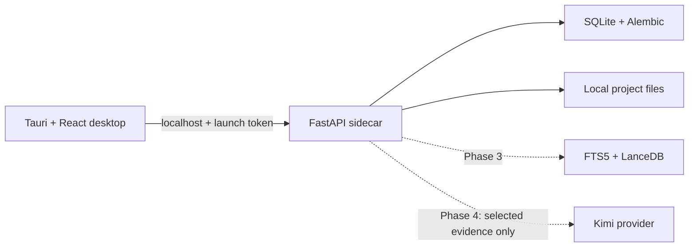

# ProjectMind Engineering AI

ProjectMind is a Windows-first engineering knowledge and document-intelligence application. It is designed to become a traceable, revision-aware project memory for construction teams rather than a general chatbot.

This repository currently contains the **complete Phase 1 foundation**:

- Tauri 2 desktop shell with a React 19 and Fluent UI interface.
- Bundled FastAPI sidecar architecture; end users will not need Python.
- Authenticated localhost communication with a random per-launch session token.
- SQLite with WAL, foreign keys, Alembic migrations, and soft-deletion.
- Project creation, editing, archiving, project defaults, and application settings.
- Backend health monitoring, consistent API errors, technical logs, and audit events.
- Automated backend/frontend checks and a Windows NSIS installer workflow.

The document library, retrieval, Kimi integration, controlled memory, and engineering review workflows are deliberately absent from the Phase 1 interface. They are delivered in Phases 2–6; there are no fake buttons.

## Architecture at a glance



See [Architecture](docs/ARCHITECTURE.md), [Implementation plan](docs/IMPLEMENTATION_PLAN.md), and [Phase 1 verification](docs/PHASE_1.md) for the complete decisions and scope.

## Developer quick start on Windows

Prerequisites are required **only for developers**:

- Windows 10/11 x64
- Python 3.12 x64
- Node.js 22 or later
- Rust stable with the MSVC target
- Microsoft C++ Build Tools and WebView2

From PowerShell:

```powershell
Set-ExecutionPolicy -Scope Process Bypass
./scripts/dev.ps1
```

The script creates an isolated Python environment, installs pinned dependencies, starts the authenticated local backend, and opens Tauri in development mode.

## Run checks

```powershell
./scripts/verify.ps1
```

Individual backend checks:

```powershell
cd apps/backend
py -3.12 -m venv .venv
./.venv/Scripts/python.exe -m pip install -r requirements-dev.lock
./.venv/Scripts/python.exe -m pytest
./.venv/Scripts/python.exe -m ruff check .
./.venv/Scripts/python.exe -m mypy app
```

Individual frontend checks:

```powershell
npm ci
npm run lint
npm run typecheck
npm test
npm run build
```

## Create the Windows installer

```powershell
./scripts/build-windows.ps1
```

The build process packages the Python backend with PyInstaller, gives the executable the target-specific name required by Tauri, builds the React application, and produces an NSIS installer under `apps/desktop/src-tauri/target/release/bundle/nsis`.

Application databases and project files live under the user's local application-data folder and are not stored in the installation directory. Normal application upgrades therefore preserve project data.

## Local API development

The backend is not intended to be exposed on a network. For API-only development:

```powershell
$env:PROJECTMIND_ENVIRONMENT = "development"
$env:PROJECTMIND_SESSION_TOKEN = "local-development-token"
cd apps/backend
./.venv/Scripts/python.exe -m app --port 8765
```

Use `X-ProjectMind-Session: local-development-token` for `/api/*` requests. `/health/live` is the only unauthenticated endpoint and reveals no project data. API documentation is available in development only at `/docs`.

## Product safety

ProjectMind assists qualified professionals; it does not replace engineering judgment, contractual review, or authority approval. Future AI-generated conclusions that could affect safety, construction, cost, design, or compliance must remain evidence-linked and subject to qualified review.

## Status

Version `0.1.0` — Phase 1 foundation. See [CHANGELOG.md](CHANGELOG.md).
