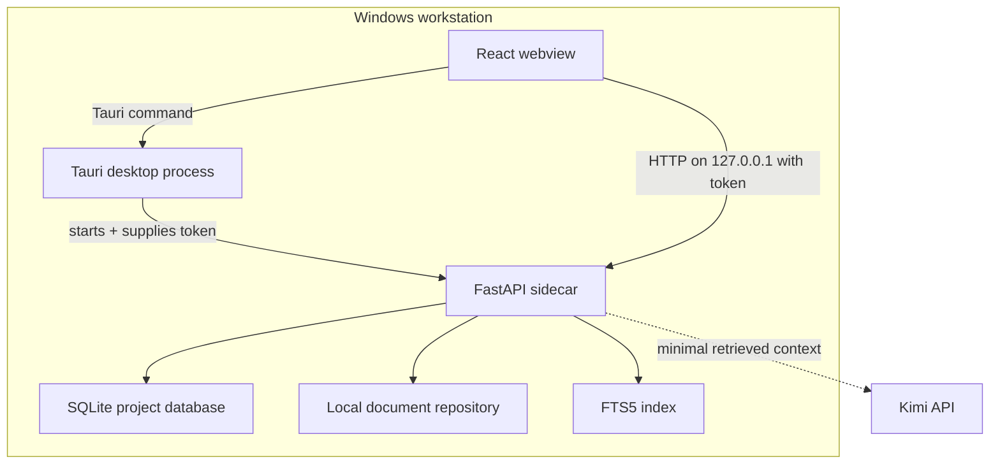
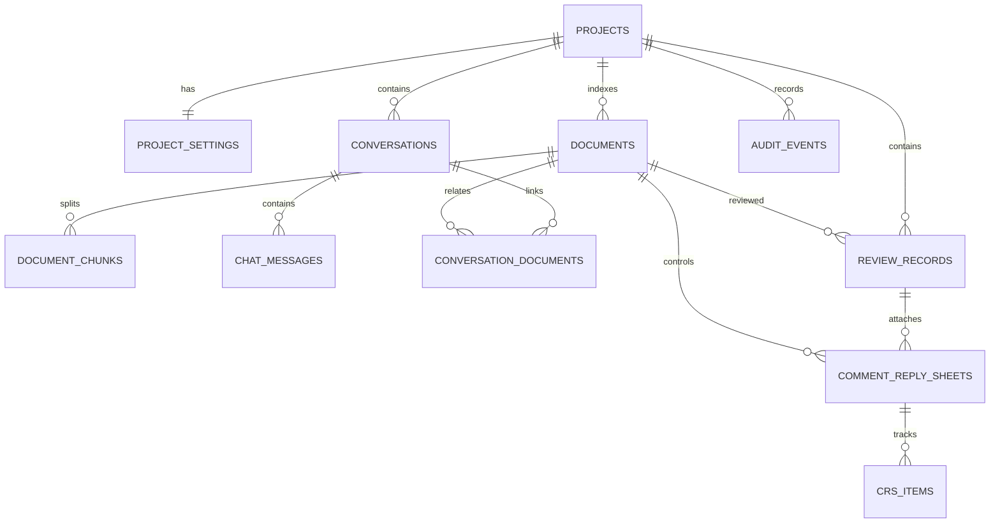

# Final technical architecture

## 1. Decision

ProjectMind uses a modular desktop-plus-sidecar architecture:

| Layer | Decision | Reason |
|---|---|---|
| Desktop | Tauri 2, React, TypeScript, Vite, Fluent UI | Native Windows shell, controlled IPC, high-DPI support, and a smaller runtime than Electron |
| Local API | Python 3.12, FastAPI, Pydantic | Mature document/OCR/AI ecosystem and strict API contracts |
| Packaging | PyInstaller one-file executable as a Tauri sidecar | No Python installation or manually started service for end users |
| Structured data | SQLite, SQLAlchemy 2, Alembic | Embedded, transactional, portable, and appropriate for a single-workstation first release |
| Passage retrieval | Overlapping document chunks + SQLite FTS5 | Co-located Unicode RAG with bounded context, source lineage, and no model download |
| Extraction | pypdf, python-docx, openpyxl, and bounded text/CSV readers | Deterministic local extraction with visible per-file failures and limits |
| Vector index | Deferred; provider boundary reserved | The current product does not claim semantic retrieval before a measured implementation exists |
| Embeddings | Deferred; BGE-M3 remains a candidate | Project content stays local while retrieval requirements are benchmarked |
| AI | Central OpenAI-compatible adapter with verified Kimi K3 behavior | Keeps model-specific parameters outside retrieval and engineering workflows |
| Secrets | Windows current-user DPAPI | The API key never enters SQLite, source, process arguments, or logs |

Tauri remains the selected desktop technology. Electron is retained only as a documented contingency if repeatable sidecar or signing failures remain after a Windows packaging spike.

## 2. Runtime topology

The desktop process selects an ephemeral loopback port, creates a 256-bit launch token, and supplies sensitive bootstrap values to the webview through a Tauri command. The token is passed to the sidecar through its environment rather than command-line arguments. The sidecar rejects non-loopback binding.

## 3. Module boundaries

- `apps/desktop`: window lifecycle, navigation, user interaction, accessibility, and backend bootstrap.
- `apps/backend/app/api`: HTTP contracts only; no business rules.
- `apps/backend/app/services`: transactions and project rules.
- `apps/backend/app/models`: persistence entities.
- `apps/backend/app/schemas`: validated public contracts.
- `apps/backend/app/database`: engine, migrations, WAL, and foreign-key behavior.
- Extraction, document indexing, retrieval, provider, chat, review/CRS, backup, and settings services remain independent of the UI. Future OCR, embedding reranking, structured requirements, export, and calculation packages plug into the same service boundary.

## 4. Data design

Version 0.3.0 persists only records that have working behavior:

| Entity | Controlled purpose |
|---|---|
| `projects` | Project identity, parties, status, timestamps, and soft deletion |
| `project_settings` | Folder, scan/exclusion behavior, disciplines, decision codes, hierarchy, precedence, project AI rules, CRS defaults, timezone, and locale |
| `documents` + `document_search` | Local extraction metadata/text, checksums, revisions, missing status, memory classification, and document-level FTS5 index |
| `document_chunks` + `document_chunk_search` | Overlapping evidence passages, character lineage, approximate size, and passage-level FTS5 retrieval |
| `conversations` + `chat_messages` | Local history, cited source metadata, and provider messages needed for valid multi-turn model behavior |
| `conversation_documents` | Durable selected-context, memory, and retrieved-evidence links between files and chats |
| `review_records` | File-linked engineering reviews, reference/discipline/due date, decision code, workflow state, AI draft, and evidence |
| `comment_reply_sheets` + `crs_items` | Review-linked consultant comments, contractor replies, consultant responses, and row/sheet closure state |
| `application_settings` | Appearance, density, retrieval budgets, provider, document, privacy, backup, and diagnostic preferences; never provider keys |
| `audit_events` | Append-only record of controlled mutations without confidential payloads |

Later migrations may add embeddings/reranking, controlled requirements, comparisons, issues, calculations, usage accounting, formatted exports, and richer backup metadata after their workflows and validation gates exist.

## 5. Retrieval and memory strategy

Each successfully extracted current document is split into stable overlapping passages. A project chat assembles context in this order:

1. passages from files the user explicitly selected for the current discussion or review;
2. relevant passages from documents marked as permanent project memory;
3. relevant passages from the rest of the current project index.

Duplicate chunks are removed and the combined evidence is capped by a configurable character budget before it reaches the provider. Conversation/file links and every returned citation retain the source document, revision, passage number, relative path, and retrieval tier. This is retrieval-augmented generation (RAG) without a vector runtime. It is the efficient default for the current Windows package because exact engineering terms, references, drawing numbers, clauses, and specification language are strong lexical signals. A vector reranker should be added only after benchmark results show a material recall improvement within acceptable memory, latency, and installer-size limits.

## 6. Security baseline

- Backend binds only to `127.0.0.1` or `::1`.
- Every `/api/*` request requires a constant-time-checked session token.
- The unauthenticated liveness endpoint returns only process state.
- API documentation is disabled outside development.
- CORS permits only known Tauri and local development origins.
- Tauri has a restrictive content-security policy and the minimum sidecar permission.
- Logs exclude request bodies, document content, session tokens, and provider keys. Backend diagnostic logging can be disabled; native startup logging remains bounded and sanitized for renderer recovery.
- Provider credentials are protected with current-user Windows DPAPI and supplied to PowerShell only over standard input.
- Database foreign keys and WAL are enabled on every connection.
- Destructive project removal is implemented as an auditable soft archive.

The launch token limits opportunistic access from other local applications; it is not a substitute for operating-system account security. Encryption at rest and enterprise key management are Phase 6 deployment options.

## 7. API conventions

- Versioned behavior begins under `/api` while the desktop and sidecar ship together.
- Strict Pydantic validation rejects unknown fields.
- Errors use one envelope: `error.code`, `error.message`, `error.details`, and `error.trace_id`.
- Lists are paginated with `items`, `total`, `limit`, and `offset`.
- Mutations execute in database transactions and emit audit events in the same transaction.
- Production OpenAPI routes are disabled unless explicitly enabled for a controlled deployment.

## 8. Evolution rules

1. Original document bytes never live in SQLite; the database stores controlled paths, checksums, bounded extracted text, and the local FTS index.
2. Every extracted or generated assertion must remain traceable to a source location.
3. Retrieval ranks current approved sources but never hides conflicts or superseded evidence.
4. Provider adapters receive only assembled evidence, not automatic full-library uploads.
5. Controlled records use migrations and revision history; user data is preserved across application upgrades.
