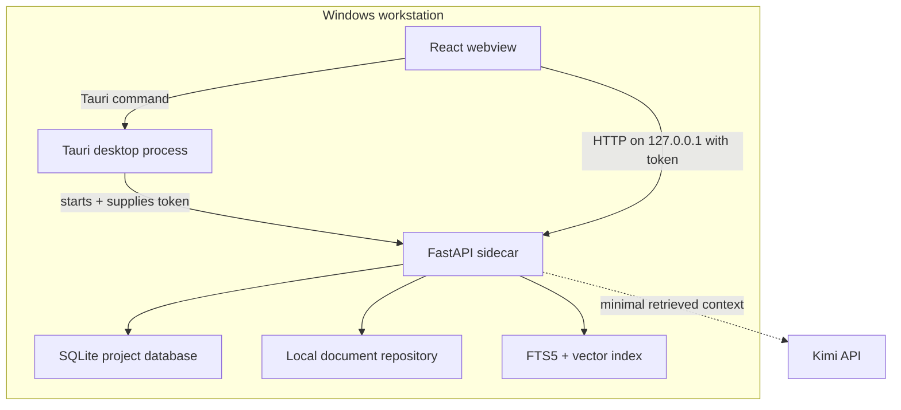
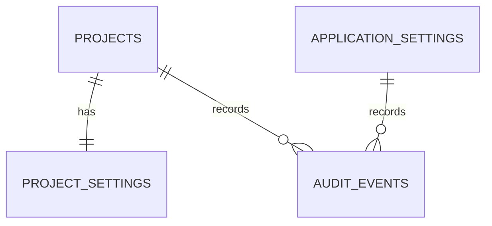

# Final technical architecture

## 1. Decision

ProjectMind uses a modular desktop-plus-sidecar architecture:

| Layer | Decision | Reason |
|---|---|---|
| Desktop | Tauri 2, React, TypeScript, Vite, Fluent UI | Native Windows shell, controlled IPC, high-DPI support, and a smaller runtime than Electron |
| Local API | Python 3.12, FastAPI, Pydantic | Mature document/OCR/AI ecosystem and strict API contracts |
| Packaging | PyInstaller one-file executable as a Tauri sidecar | No Python installation or manually started service for end users |
| Structured data | SQLite, SQLAlchemy 2, Alembic | Embedded, transactional, portable, and appropriate for a single-workstation first release |
| Keyword index | SQLite FTS5 in Phase 3 | Co-located exact search without another service |
| Vector index | LanceDB behind a provider interface in Phase 3 | Embedded Windows-friendly deployment and replaceable implementation |
| Embeddings | Local BGE-M3 provider in Phase 3, with lighter alternatives | Multilingual English/Arabic retrieval while keeping project content local |
| AI | Provider adapter; Kimi implemented in Phase 4 | Keeps model-specific behavior outside retrieval and engineering workflows |
| Secrets | Windows Credential Manager/DPAPI in Phase 4 | The API key never enters SQLite, source, or logs |

Tauri remains the selected desktop technology. Electron is retained only as a documented contingency if repeatable sidecar or signing failures remain after a Windows packaging spike.

## 2. Runtime topology

The desktop process selects an ephemeral loopback port, creates a 256-bit launch token, and supplies sensitive bootstrap values to the webview through a Tauri command. The token is passed to the sidecar through its environment rather than command-line arguments. The sidecar rejects non-loopback binding.

## 3. Module boundaries

- `apps/desktop`: window lifecycle, navigation, user interaction, accessibility, and backend bootstrap.
- `apps/backend/app/api`: HTTP contracts only; no business rules.
- `apps/backend/app/services`: transactions and project rules.
- `apps/backend/app/models`: persistence entities.
- `apps/backend/app/schemas`: validated public contracts.
- `apps/backend/app/database`: engine, migrations, WAL, and foreign-key behavior.
- Future parser, ingestion, retrieval, embedding, LLM, memory, and calculation packages plug into the service layer and do not couple to the UI.

## 4. Data design

Phase 1 creates only records that have working behavior:

| Entity | Controlled purpose |
|---|---|
| `projects` | Project identity, parties, status, timestamps, and soft deletion |
| `project_settings` | Disciplines, review codes, document hierarchy, precedence, timezone, and locale |
| `application_settings` | Configurable brand, theme, locale, and backup preferences |
| `audit_events` | Append-only record of controlled mutations without confidential payloads |

Later migrations add the document, version, chunk, conversation, citation, memory, requirement, review, comparison, issue, decision, calculation, usage, and backup entities described in the master specification. Creating unused tables in Phase 1 would provide no verified behavior and would harden untested schemas prematurely.

## 5. Security baseline

- Backend binds only to `127.0.0.1` or `::1`.
- Every `/api/*` request requires a constant-time-checked session token.
- The unauthenticated liveness endpoint returns only process state.
- API documentation is disabled outside development.
- CORS permits only known Tauri and local development origins.
- Tauri has a restrictive content-security policy and the minimum sidecar permission.
- Logs exclude request bodies, document content, session tokens, and future API keys.
- Database foreign keys and WAL are enabled on every connection.
- Destructive project removal is implemented as an auditable soft archive.

The launch token limits opportunistic access from other local applications; it is not a substitute for operating-system account security. Encryption at rest and enterprise key management are Phase 6 deployment options.

## 6. API conventions

- Versioned behavior begins under `/api` while the desktop and sidecar ship together.
- Strict Pydantic validation rejects unknown fields.
- Errors use one envelope: `error.code`, `error.message`, `error.details`, and `error.trace_id`.
- Lists are paginated with `items`, `total`, `limit`, and `offset`.
- Mutations execute in database transactions and emit audit events in the same transaction.
- Production OpenAPI routes are disabled unless explicitly enabled for a controlled deployment.

## 7. Evolution rules

1. Document bytes never live in SQLite; the database stores controlled paths and checksums.
2. Every extracted or generated assertion must remain traceable to a source location.
3. Retrieval ranks current approved sources but never hides conflicts or superseded evidence.
4. Provider adapters receive only assembled evidence, not automatic full-library uploads.
5. Controlled records use migrations and revision history; user data is preserved across application upgrades.
